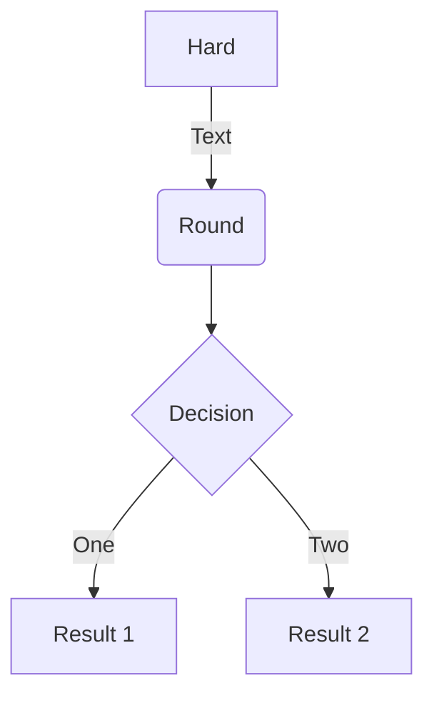
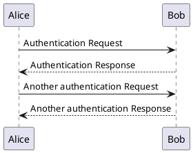
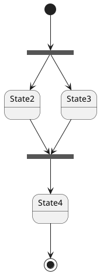
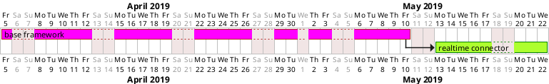

# mkdocs demos
This documentation was built by [Mkdocs](https://www.mkdocs.org/#getting-started). It is a python package allowing to pack markdown documentation to html pages. It is required to install some python packages

    python -m pip install mkdocs pymdown-extensions plantuml_markdown

Some usefull links

- Standard [markdown](https://www.markdownguide.org/) syntax.
- Full [mkdocs.org](https://mkdocs.org) documentation.
- List of bundles [markdown extensions](https://facelessuser.github.io/pymdown-extensions/)
- Some interesting third party [markdown extensions](https://github.com/Python-Markdown/markdown/wiki/Third-Party-Extensions):

    - [markdown-katex](https://gitlab.com/mbarkhau/markdown-katex)
    - [plantuml-markdown](https://github.com/mikitex70/plantuml-markdown)

Some example of mkdocs capacities :

- [Internal linking](#internal-linking)
- [Code listing](#code-listing)
- [Math latex katex](#math-latex)
- [PlantUML diagrams](#plantuml)
- [Other interesting diagrams](#other-interesting-diagrams)
- [Other interesting extensions](#other-interesting-extensions)

**Directories structure**
```
|---docs
|    |---index.md
|    |---My_Page_1.md
|    |---My_Page_2.md
|    |---...
|    |---My_Page_N.md
|---mkdocs.yml
```
File `mkdocs.yml` contains the configuration for the mkdocs build. Mardown files are inside the directory docs, where the page `index.md` is required as the home page. Example of `mkdocs.yml`
```yaml
site_name: my doc title

nav:
    - My Home Page : index.md
    - My Page Title 1 : DocPage1.md
    - My Page Title 1 : DocPage2.md

markdown_extensions:
  - toc:
  - pymdownx.arithmatex
  - plantuml_markdown:  # use for plantuml functionalities

extra_javascript:
    - 'https://cdnjs.cloudflare.com/ajax/libs/mathjax/2.7.0/MathJax.js?config=TeX-MML-AM_CHTML' # mathjax

extra_css:
#    - 'https://cdnjs.cloudflare.com/ajax/libs/KaTeX/0.9.0/katex.min.css'
     - css/my_extra.css

theme: readthedocs
```

Build and visualize
```console
my_doc_dir$> mkdocs build --help
my_doc_dir$> mkdocs build
my_doc_dir$> mkdocs serve
```
Build and visualize out of source
```console
my_doc_dir$> mkdocs build -c -d /path/to/output/directory
my_doc_dir$> python -m http.server -d /path/to/output/directory/my_doc_dir
```

Then open the browser with url [http://127.0.0.1:8000](http://127.0.0.1:8000)

---

## Mkdocs capabilities

#### Internal linking
mkdocs automatically convert all session header to lower characters and concatenate using '-' to make and internal linking reference. Example a chapter is written as follow
```
#### My section 1
...
#### My section 2
...
#### My section n
```

Then the summary at the begining of the section would be:
```
Summary
- [My section 1](#my-section-1)
- [My section 2](#my-section-2)
- [My section n](#my-section-n)
```


#### Code listing
C++
```c++
const std::string hello {};
```

#### MathJax latex
For mathematical formulas, the default usage is to use MathJAX functionalities, which is by default using arithmatex. In future, katex might be prefered. Assuming the pymdown-extensions has been installed. The `mkdocs.yml` files need to include the following for MathJAX functions
```yaml
markdown_extensions:
  - pymdownx.arithmatex
extra_javascript:
  - 'https://cdnjs.cloudflare.com/ajax/libs/mathjax/2.7.0/MathJax.js?config=TeX-MML-AM_CHTML' # mathjax
```
The math formula `$a^2+b^2=c^2$` will give inline math $a^2+b^2=c^2$. And the new line math formula
```latex
$$
f(x) = \int_{-\infty}^\infty \hat f(\xi)\,e^{2 \pi i \xi x} \,d\xi \frac{n!}{k!(n-k)!} = \binom{n}{k}
$$
```
will give the out line math formula
$$
f(x) = \int_{-\infty}^\infty \hat f(\xi)\,e^{2 \pi i \xi x} \,d\xi \frac{n!}{k!(n-k)!} = \binom{n}{k}
$$

#### mermaid
[Mermaid](https://github.com/mermaid-js/mermaid) can be activated by [superfences](https://facelessuser.github.io/pymdown-extensions/extensions/superfences/) extension. To configure it, add to `mkdocs.yml` file :
```yaml
markdown_extensions:
  - pymdownx.superfences:
      custom_fences:
        - name: mermaid
          class: mermaid
          format: !!python/name:pymdownx.superfences.fence_div_format
extra_javascript:
  - 'https://unpkg.com/mermaid@8.4.6/dist/mermaid.min.js'
```
Then you can add inside a `mermaid` block 
```none
graph TD
    A[Hard] -->|Text| B(Round)
    B --> C{Decision}
    C -->|One| D[Result 1]
    C -->|Two| E[Result 2]
```
It will give the [graph](https://mermaid-js.github.io/mermaid-live-editor)



#### PlantUML
[Plantuml](https://plantuml.com/) has quite a lot of functionalities to draw diagrams. It is well [documented](http://plantuml.com/guide) and can be [tested online](https://www.planttext.com/). First, the Python's package [plantuml-markdown](https://github.com/mikitex70/plantuml-markdown) need to be installed
```bash
prompt$> python -m pip install plantuml-markdown
```
Add to `mkdocs.yml` file :
```yaml
markdown_extensions:
  - plantuml_markdown:
```
There are an extra step to make plantuml work locally. A executable file plantuml need to be created and the plantuml.jar file need to be put alongside. Both of the files should be put in the directories where PATH is aware of.

On windows, create the plantuml.cmd file
```batch
@echo off
java -jar "%~dp0\plantuml.jar" %*
```

On unix, create the plantuml file (don't forget to chmod+x it)
```bash
#!/bin/bash
java -jar $(dirname "$0")/plantuml.jar "$@"
```

#### [PlantUML sequence diagram](https://plantuml.com/sequence-diagram)
```
    @startuml
    Alice -> Bob: Authentication Request
    Bob --> Alice: Authentication Response
    Alice -> Bob: Another authentication Request
    Alice <-- Bob: Another authentication Response
    @enduml
```



#### [PlantUML state diagram](https://plantuml.com/state-diagram)
```
@startuml
state fork_state <<fork>>
[*] --> fork_state
fork_state --> State2
fork_state --> State3
state join_state <<join>>
State2 --> join_state
State3 --> join_state
join_state --> State4
State4 --> [*]
@enduml
```



#### [PlantUML grantt diagram](https://plantuml.com/gantt-diagram)
```
@startgantt
project starts the 2019/04/05
saturday are closed
sunday are closed
2019/05/01 is closed
2019/04/17 to 2018/04/19 is closed
[base framework] lasts 25 days
[realtime connector] lasts 8 days
[realtime connector] starts at [base framework]'s end
[base framework] is colored in Fuchsia/FireBrick 
[realtime connector] is colored in GreenYellow/Green 
@endgantt
```



## More functionalities
- Theming
- Other interesting extensions